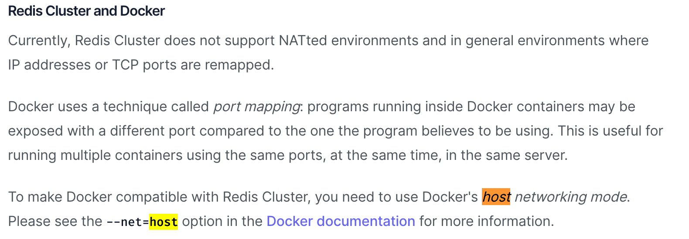
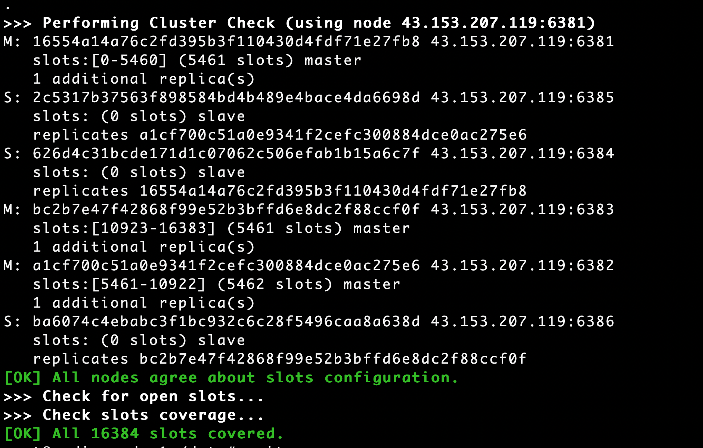

<!--
 * @Author: double55 doublel0205@gmail.com
 * @Date: 2023-03-19 15:23:52
 * @LastEditors: double55 doublel0205@gmail.com
 * @LastEditTime: 2023-03-29 00:14:49
 * @FilePath: /redis/cluster.md
 * @Description: 
 * Copyright (c) 2023 by double55 email: doublel0205@gmail.com, All Rights Reserved.
-->
# redis 三主三从配置（docker-compose启动）

- 默认已经装好docker

## 拉取redis镜像

```docker
docker pull redis
```

## 选择喜欢的目录并创建文件夹

1. 下载redis.conf，并移到该目录下
[redis.conf](http://download.redis.io/redis-stable/redis.conf)

2. 创建相关文件夹（文件）
```linux
# 数据挂载目录
mkdir -p volume/data/redis-node-6381
mkdir -p volume/data/redis-node-6382
mkdir -p volume/data/redis-node-6383
mkdir -p volume/data/redis-node-6384
mkdir -p volume/data/redis-node-6385
mkdir -p volume/data/redis-node-6381

# redis.conf挂载目录
mkdir -p volume/conf

cp redis.conf volume/conf/redis_node_6381.conf
cp redis.conf volume/conf/redis_node_6382.conf
cp redis.conf volume/conf/redis_node_6383.conf
cp redis.conf volume/conf/redis_node_6384.conf
cp redis.conf volume/conf/redis_node_6385.conf
cp redis.conf volume/conf/redis_node_6381.conf
```

## 修改conf文件相应的配置

- 以6381端口为例
```
# 开启redis验证(可选)
requirepass 123（密码）
masterauth 123（密码）

bind 127.0.0.1 # 添加#号、注释，允许redis外地链接

# 开启redis数据持久化(可选)
appendonly yes

protected-mode no
port 6381

# 将daemonize yes注释起来或者 daemonize no设置，因为该配置和docker run中-d参数冲突，会导致容器一直启动失败
daemonize no
cluster-enabled yes
cluster-config-file nodes_6381.conf
cluster-node-timeout 5000
# cluster-announce-ip 172.172.0.1 # IP地址
cluster-announce-port 6381
cluster-announce-bus-port 16381
pidfile /var/run/redis_6381.pid
```

## 编写docker-compose.yml文件

1. 创建文件
```linux
vim docker-compose.yml
```

2. 追加内容

- 按照 Redis 官网：[](https://redis.io/docs/management/scaling/) 的提示，为了使 Docker 与 Redis Cluster 兼容，您需要使用 Docker 的 host 网络模式。



```linux
version: '3.8'

services:
        redis_node_1:
                image: redis:latest
                container_name: redis_node_1
                hostname: redis_node_1
                network_mode: 'host'  # 网络模式
                ports:
                        - '6381:6381'
                        - '16381:16381'
                privileged: true
                restart: always
                volumes:
                        - './volume/conf/redis_node_6381.conf:/etc/redis/redis.conf'
                        - './volume/data/redis-node-6381:/data'
                command: redis-server /etc/redis/redis.conf
        redis_node_2:
                image: redis:latest
                container_name: redis_node_2
                hostname: redis_node_2
                network_mode: 'host'
                ports:
                        - '6382:6382'
                        - '16382:16382'
                privileged: true
                restart: always
                volumes:
                        - './volume/conf/redis_node_6382.conf:/etc/redis/redis.conf'
                        - './volume/data/redis-node-6382:/data'
                command: redis-server /etc/redis/redis.conf
        redis_node_3:
                image: redis:latest
                container_name: redis_node_3
                hostname: redis_node_3
                network_mode: 'host'
                ports:
                        - '6383:6383'
                        - '16383:16383'
                privileged: true
                restart: always
                volumes:
                        - './volume/conf/redis_node_6383.conf:/etc/redis/redis.conf'
                        - './volume/data/redis-node-6383:/data'
                command: redis-server /etc/redis/redis.conf
        redis_node_4:
                image: redis:latest
                container_name: redis_node_4
                hostname: redis_node_4
                network_mode: 'host'
                ports:
                        - '6384:6384'
                        - '16384:16384'
                privileged: true
                restart: always
                volumes:
                        - './volume/conf/redis_node_6384.conf:/etc/redis/redis.conf'
                        - './volume/data/redis-node-6384:/data'
                command: redis-server /etc/redis/redis.conf
        redis_node_5:
                image: redis:latest
                container_name: redis_node_5
                hostname: redis_node_5
                network_mode: 'host'
                ports:
                        - '6385:6385'
                        - '16385:16385'
                privileged: true
                restart: always
                volumes:
                        - './volume/conf/redis_node_6385.conf:/etc/redis/redis.conf'
                        - './volume/data/redis-node-6385:/data'
                command: redis-server /etc/redis/redis.conf
        redis_node_6:
                image: redis:latest
                container_name: redis_node_6
                hostname: redis_node_6
                network_mode: 'host'
                ports:
                        - '6386:6386'
                        - '16386:16386'
                privileged: true
                restart: always
                volumes:
                        - './volume/conf/redis_node_6386.conf:/etc/redis/redis.conf'
                        - './volume/data/redis-node-6386:/data'
                command: redis-server /etc/redis/redis.conf
```

## 创建并启动服务

```docker
docker-compose up -d
```

## 创建集群

1. 进入启动的容器

```docker
docker exec -it redis_container_id /bin/bash
```

2. 保证通信

- host_ip 宿主机ip

+ 不带密码集群创建
```redis
redis-cli --cluster create host_ip:6381 host_ip:6382 host_ip:6383 host_ip:6384 host_ip:6385 host_ip:6386 --cluster-replicas 1
```

```redis
redis-cli --cluster create host_ip:6381 host_ip:6382 host_ip:6383 host_ip:6384 host_ip:6385 host_ip:6386 --cluster-replicas 1 -a mima
```

3. 在提示选项中输入yes

4. 出现以下类似界面，表示成功



## 链接进入6381作为切入点、查看节点状态

- 默认已经进入改容器
> -c：表示开启集群模式；-p：集群端口；-a：密码；--raw：显示中文

```redis
redis-cli -c -p 6381 -a mima --raw

auth "mima"

cluster info
cluster nodes
```

## 设置密码

```redis
redis-cli -c -p 6381

config set requirepass mima     # 设置密码
config set masterauth mima      # 设置从节点连接主节点的密
 config rewrite                 # 刷新配置
```
